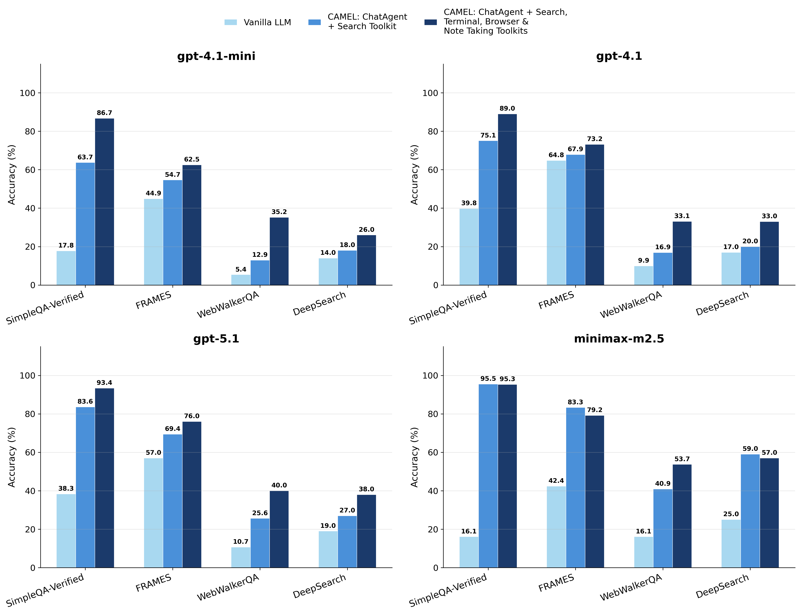
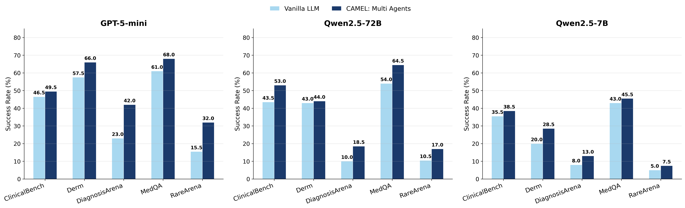

## Figure 1. Web Search: Vanilla LLM v.s. CAMEL Agent

## Figure 2. Medical Consultation: Vanilla LLM v.s. CAMEL Agents

## Table 1. SimpleQA-Verified Ablation Study (Accuracy, %).
|SimpleQA-Verified (Acc., %)|Vanilla LLM|CAMEL:ChatAgent+Search Toolkit|CAMEL: ChatAgent+Search, Terminal, Browser and Note Taking Toolkits|
|-|-|-|-|
|gpt-4.1-mini|17.8|63.7|**86.7**|
|gpt-4.1|39.8|75.1|**89.0**|
|gpt-5.1|38.3|83.6|**93.4**|
|minimax-m2.5|16.1|**95.5**|95.3|

## Table 2. BrowseComp Ablation Study (Accuracy, %).
|BrowseComp (Acc., %)|Vanilla LLM|CAMEL: ChatAgent+Search, Terminal, Browser and Note Taking Toolkits|
|-|-|-|
|gpt-4.1-mini|1.5|**3.2**|
|gpt-4.1|3.2|-|

## Table 3. FRAME Ablation Study (Accuracy, %).
|FRAMES (Acc., %)|Vanilla LLM|CAMEL:ChatAgent+Search Toolkit|CAMEL: ChatAgent+Search, Terminal, Browser and Note Taking Toolkits|
|-|-|-|-|
|gpt-4.1-mini|44.9|54.7|**62.5**|
|gpt-4.1|64.8|67.9|**73.2**|
|gpt-5.1|57.0|69.4|**76.0**|
|minimax-m2.5|42.4|**83.3**|79.2|

## Table 4. WebWalkerQA Ablation Study (Accuracy, %).
|WebWalkerQA (Acc., %)|Vanilla LLM|CAMEL:ChatAgent+Search Toolkit|CAMEL: ChatAgent+Search, Terminal, Browser and Note Taking Toolkits|
|-|-|-|-|
|gpt-4.1-mini|5.4|12.9|**35.2**|
|gpt-4.1|9.9|16.9|**33.1**|
|gpt-5.1|10.7|25.6|**40.0**|
|minimax-m2.5|16.1|40.9|**53.7**|

## Table 5. DeepSearch Ablation Study (Accuracy, %).
|DeepSearch (Acc., %)|Vanilla LLM|CAMEL:ChatAgent+Search Toolkit|CAMEL: ChatAgent+Search, Terminal, Browser and Note Taking Toolkits|
|-|-|-|-|
|gpt-4.1-mini|14.0|18.0|**26.0**|
|gpt-4.1|17.0|20.0|**33.0**|
|gpt-5.1|19.0|27.0|**38.0**|
|minimax-m2.5|25.0|**59.0**|57.0|

## Table 6. SWE-bench Agent System Prompt

| Prompt | Content |
|--------|---------|
| **System Prompt** | You are a senior software engineer solving a SWE-bench task inside a Docker container.  Rules: - Use `sh` to inspect the repo (search, read files, run commands). Keep outputs small. - Make code changes by calling `apply_patch` with a unified diff. - Run `run_tests` to evaluate; iterate until `resolved=true`. - Keep changes minimal. Do not commit. Do not modify tests. - When resolved, stop and briefly summarize what changed.  IMPORTANT: Your patch MUST use standard Unified Diff format: `diff --git a/path/to/file.py b/path/to/file.py` `--- a/path/to/file.py` `+++ b/path/to/file.py` `@@ -10,3 +10,3 @@` `·def my_function():` `-····old_code()` `+····new_code()` `·····return True` |
| **Round 0** (initial, always triggered) | You are solving a SWE-bench_Verified task inside a Docker container.  Instance ID: `{instance_id}` Repo: `{repo}` Base commit: `{base_commit}` Version: `{version}`  Problem statement: `{problem_statement}`  Baseline test result JSON (from run_tests): `{baseline_test_result}`  Now: inspect the repo and failures using tools, then fix the bug. You MUST make code changes by calling apply_patch with a unified diff. After applying a patch, run run_tests again to check resolved. |
| **Round 1+** (default, normal case) | Here is the last test result JSON from run_tests: `{last_test_result}`  Your job: - Use tools to locate the root cause. - Apply a minimal patch via apply_patch. - Then run run_tests. |
| **Round 1+** (git diff is empty) | No code changes were detected (git diff is empty). You must produce and apply a patch now. Call apply_patch with a valid unified diff that edits the repo. Then call run_tests. |
| **Round 1+** (only test files modified) | Your patch only modified test files, which is not allowed in SWE-bench. Revert test file changes and fix the bug in the library/source code instead. Use shell_exec + apply_patch to update non-test files. |
| **Round 1+** (tests still failing) | Continue fixing. Use the latest test result and keep changes minimal. |

## Table 7. MME bench: Multi-Agent Framework Prompts
| Agent / Module | Prompt Type | Content |
|:---|:---|:---|
| **1. Role Assignment Agent** | Role Assignment Task | We need to assemble a team of experts for an image analysis task.  Task Type: `{task_type}` Task Description: `{strategy['task_description']}` Key Focus: `{', '.join(strategy['key_focus'])}`  Please assign 3 expert roles, each of which should: 1. Be specifically tailored to the key requirements of the `{task_type}` task 2. Have clear professional division of labor and responsibilities 3. Be able to work collaboratively to complete the image analysis task 4. Ensure the final answer is strictly limited to "yes" or "no"  Please provide a clear description of responsibilities for each expert role. |
| **2. Task Planner Agent** | Task Planning Prompt | Please create a detailed analysis plan for the following image analysis task:  \#\# Task Information • Task Type: `{task_type}` • Task Description: `{strategy['task_description']}` • Key Focus: `{', '.join(strategy['key_focus'])}`  \#\# Expert Team `{expert_team_desc}`  \#\# Planning Requirements Please create a detailed analysis process, including: 1. Analysis steps and sequence, making full use of the professional capabilities of the expert team 2. Specific tasks and responsible experts for each step 3. Mechanisms and communication processes for expert collaboration 4. Special considerations for the `{task_type}` task 5. Quality control and quality assurance measures 6. The final answer must be strictly limited to "yes" or "no" |
| **3. Expert Analysis Agent** | System Prompt | You are `{role_name}`, `{role_desc}`.  You are currently performing analysis work for the `{task_type}` task. Please strictly follow the CAMEL-generated analysis plan for professional analysis.  \#\# Task-Specific Guidance [Detailed task guidance, see Appendix Module A]  Please conduct your analysis from your professional perspective based on the above guidance. The answer must be yes or no. |
| | User Task Prompt | \#\# Analysis Task Question: `{question}`  \#\# Your Professional Responsibilities `{role_desc}`  \#\# Task-Specific Guidance Please conduct your professional analysis according to the CAMEL-generated analysis plan to ensure accuracy.  Please provide your professional analysis: |
| **4. Project Manager Agent** | System Prompt | You are the project manager, and you need to synthesize the opinions of all experts to provide a final analysis report.  \#\# Current Task Type: `{task_type}`  \#\# Expert Team `{expert_team_desc}`  \#\# Task-Specific Guidance [Detailed task guidance, see Appendix Module A]  Please strictly coordinate the opinions of all experts according to the CAMEL-generated task plan to ensure that the final answer meets the requirements. The answer must be either yes or no, without additional explanation. |
| | User Task Prompt (Synthesis) | \#\# Task Synthesis Report Requirements Task Type: `{task_type}` Question: `{question}`  \#\# Expert Analysis Results `{expert_responses}`  \#\# Synthesis Guidance Please perform the final synthesis according to the following CAMEL-generated task plan: `{task_plan}`  Key Requirements: 1. Strictly follow the analysis focus of the `{task_type}` task 2. Ensure the answer is based on the actual content of the image 3. Make full use of the professional opinions of the expert team 4. The final answer must be either yes or no. |
| **5. Fallback Agents** | Direct Analyst (System) | Please analyze the image directly based on the requirements of the `{task_type}` task. The answer must be yes or no. |
| | Text-only Analyst (System) | Please analyze the question based on the requirements of the `{task_type}` task. |
| **Appendix A: Guidance** | Dynamic Injection Template | \# Task-Specific Guidance (Generated by CAMEL Agent)  \#\# Basic Task Information • Task Type: `{task_type}` • Task Description: `{strategy['task_description']}` • Key Focus: `{', '.join(strategy['key_focus'])}`  \#\# Expert Team (Assigned by RoleAssignmentAgent) `{expert_team_desc}`  \#\# Analysis Plan (Created by TaskPlannerAgent) `{task_plan}`  \#\# Core Requirements 1. The answer must be strictly limited to "yes" or "no" 2. Base the answer on the actual content of the image 3. Make full use of the professional division of labor of the expert team 4. Strictly follow the steps and requirements of the analysis plan |

## Table 8. PopQA: Agent System Prompt
| Agent | System Prompt |
| --- | --- |
| REWRITE_SYSTEM | You generate search queries for question answering.  Given a question, produce a small set of concise search queries that help retrieve evidence for the exact entity and relation asked in the question.  Return the result using the following XML structure only: &lt;rewrite&gt; &nbsp;&nbsp;&lt;queries&gt; &nbsp;&nbsp;&nbsp;&nbsp;&lt;query&gt;...&lt;/query&gt; &nbsp;&nbsp;&lt;/queries&gt; &nbsp;&nbsp;&lt;entities&gt; &nbsp;&nbsp;&nbsp;&nbsp;&lt;entity&gt;...&lt;/entity&gt; &nbsp;&nbsp;&lt;/entities&gt; &lt;/rewrite&gt;  Prefer queries that disambiguate short or ambiguous titles by adding likely media, person, work, place, or domain hints when appropriate. Include the original entity name exactly as written in the question in at least one query. Do not add explanations. |
| ANSWER_SYSTEM | You answer factual questions using the provided passages. Return the shortest standalone answer span that is directly supported by the passages. Return the answer inside &lt;answer&gt; and &lt;/answer&gt; without explanation. For example: &lt;answer&gt;politician&lt;/answer&gt;. If the passages do not clearly support an answer, return &lt;answer&gt;unknown&lt;/answer&gt;. Do not return a full sentence when a shorter answer span is sufficient. Prefer a short canonical answer without extra descriptive words. If multiple labels, roles, or titles are mentioned, return only the single most central one. |
| JUDGE_SYSTEM | You verify whether a proposed answer is directly supported by the provided passages. Return only the following XML structure: &lt;verification&gt; &nbsp;&nbsp;&lt;supported&gt;true&#124;false&lt;/supported&gt; &nbsp;&nbsp;&lt;passage_id&gt;1&lt;/passage_id&gt; &nbsp;&nbsp;&lt;quote&gt;exact supporting text&lt;/quote&gt; &nbsp;&nbsp;&lt;canonical_answer&gt;shortest standalone answer string&lt;/canonical_answer&gt; &lt;/verification&gt;  If the answer is not directly supported, set supported to false, passage_id to null, quote to empty, and canonical_answer to empty. If the answer is directly supported, canonical_answer must be the shortest standalone answer string supported by the passages, not a full sentence, not a list, and not multiple roles or titles. Do not add any explanation. |